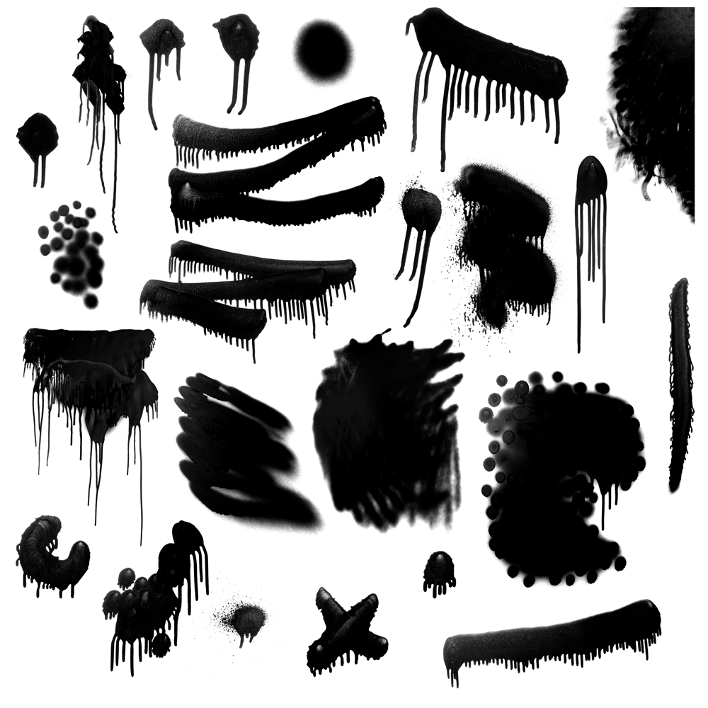

# Photoshop “spray paint” brushes

1. Spray paint [717x2500]
1. Spray paint [489x864]
1. Spray paint [541x1283]
1. Spray paint [551x1165]
1. Spray paint [1133x1147]
1. Spray paint [1870x1888]
1. Spray paint [2500x1436]
1. Spray paint [784x1804]
1. Spray paint [1685x2434]
1. Spray paint [1933x2500]
1. Spray paint [1766x1893]
1. Spray paint [796x850]
1. Spray paint [786x1266]
1. Spray paint [1548x2500]
1. Spray paint [1223x1793]
1. Spray paint [381x549]
1. Spray paint [377x2270]
1. Spray paint [857x960]
1. Spray paint [941x1033]
1. Spray paint [319x2500]
1. Spray paint [2500x1572]
1. Spray paint [2500x1027]
1. Spray paint [1768x2368]
1. Spray paint [1109x2500]

---

Copyright © 2014 [Micky Hulse](http://mky.io).

Licensed under the Apache License, Version 2.0 (the “License”); you may not use this work except in compliance with the License. You may obtain a copy of the License in the LICENSE file, or at:

[http://www.apache.org/licenses/LICENSE-2.0](http://www.apache.org/licenses/LICENSE-2.0)

Unless required by applicable law or agreed to in writing, software distributed under the License is distributed on an “AS IS” BASIS, WITHOUT WARRANTIES OR CONDITIONS OF ANY KIND, either express or implied. See the License for the specific language governing permissions and limitations under the License.

